# SLOPGUARD
### AI Dependency Control Plane & Supply-Chain Firewall

> **Verify identity • Score trust • Remember phantoms • Repair safely • Gate installation**

[](https://pypi.org/project/slopguard-ai/#description)
[](https://marketplace.visualstudio.com/items?itemName=vishaldubey2210.slopguard)
[](https://pypi.org/project/slopguard-ai/)
[](LICENSE)
[](tests/)

---

## Project Links

- **GitHub Repository**: [https://github.com/Vishaldubey2210/win_if_you_can](https://github.com/Vishaldubey2210/win_if_you_can)
- **PyPI Package (`slopguard-ai`)**: [https://pypi.org/project/slopguard-ai/#description](https://pypi.org/project/slopguard-ai/#description)
- **VS Code Marketplace (`vishaldubey2210.slopguard`)**: [https://marketplace.visualstudio.com/items?itemName=vishaldubey2210.slopguard](https://marketplace.visualstudio.com/items?itemName=vishaldubey2210.slopguard)
- **Model Context Protocol (MCP) Guide**: [docs/mcp-server-guide.md](docs/mcp-server-guide.md)

---

## Table of Contents

1. [The Problem](#1-the-problem)
2. [Threat Model](#2-threat-model)
3. [Core Principle](#3-core-principle)
4. [Solution](#4-solution)
5. [Architecture](#5-architecture)
6. [The Nine-Stage Pipeline](#6-the-nine-stage-pipeline)
7. [Identity Graph](#7-identity-graph)
8. [Evidence Graph](#8-evidence-graph)
9. [Trust Engine](#9-trust-engine)
10. [Temporal Phantom Memory](#10-temporal-phantom-memory)
11. [Contextual Repair Loop](#11-contextual-repair-loop)
12. [Policy-as-Code & Profiles](#12-policy-as-code--profiles)
13. [Multi-Interface Architecture & Working Flows](#13-multi-interface-architecture--working-flows)
    - [13.1 Web Dashboard (GUI)](#131-web-dashboard-gui)
    - [13.2 Model Context Protocol (MCP) Server](#132-model-context-protocol-mcp-server)
    - [13.3 VS Code Extension](#133-vs-code-extension)
    - [13.4 CLI & CI/CD Pipeline](#134-cli--cicd-pipeline)
14. [Failure-Safe Design](#14-failure-safe-design)
15. [Benchmark & Evaluation](#15-benchmark--evaluation)
16. [Security Model & Limitations](#16-security-model--limitations)
17. [Repository Structure](#17-repository-structure)
18. [Testing & Verification](#18-testing--verification)
19. [Installation & Quickstart](#19-installation--quickstart)
20. [License](#20-license)

---

## 1. The Problem

Modern AI coding agents (Claude, Copilot, Cursor, Devin, Windsurf) frequently hallucinate non-existent package dependencies or confuse internal module imports with external distribution specifiers.

Attackers exploit this through **Phantom Dependency Hijacking** and **Pre-Registration Attacks**:
1. An LLM suggests a convincing but non-existent package (e.g. `langchain-hyper-fast-auth` or typosquat `requets`).
2. Attackers continuously scrape public AI prompts, repositories, and benchmark datasets for unresolvable packages.
3. The attacker registers the hallucinated name on PyPI or npm with malicious pre-install hooks (`setup.py` / `install.js`).
4. When the developer or automated AI agent runs `pip install` or `npm install`, the malicious code executes with full local privileges, leading to Remote Code Execution (RCE) and credential theft.

Traditional Software Composition Analysis (SCA) runs *after* installation in CI/CD, which is fatally too late.

---

## 2. Threat Model

| Threat Vector | Attack Surface | Impact | Mitigation in SLOPGUARD |
| :--- | :--- | :--- | :--- |
| **Phantom Hallucinations** | AI code generation / imports | RCE via pre-registration | Pre-install registry check + temporal memory |
| **Typosquatting** | Lookalike package names | Malware execution | Damerau-Levenshtein distance + popularity analysis |
| **Unicode Confusables** | Homoglyphs (Cyrillic `а` vs Latin `a`) | Package impersonation | Unicode confusable skeleton matching |
| **Dependency Confusion** | Internal module vs Public PyPI | Organization asset compromise | PEP 503 normalization + stdlib/internal resolution |
| **Transient Registry Outage**| Network drop / HTTP 429 / 503 | False positive blockage | Fails safe to `HOLD / REVIEW`; never `NOT_FOUND` |
| **Silent Repair Exploitation**| Patching without rescan | Introducing fresh vulnerabilities | Mandatory `PATCH -> RESCAN -> VERIFY` validation gate |

---

## 3. Core Principle

```
EXISTENCE != TRUST != FUTURE SAFETY
```

- **Existence**: Just because a package exists on PyPI does NOT mean it is safe.
- **Trust**: Verified release counts, repository provenance, maintainer history, and vulnerability advisories determine trust.
- **Future Safety**: A package that was missing yesterday and appeared today is an anomaly (`APPEARED`), not automatically safe.

---

## 4. Solution

**SLOPGUARD** (`slopguard-ai`) is an enterprise-grade, pre-install AI Dependency Control Plane and Supply-Chain Firewall. It intercepts dependency definitions in real time, computes multi-dimensional trust scores, tracks historical observations, suggests verified repairs, and enforces deterministic Policy-as-Code gates (`ALLOW`, `HOLD`, `BLOCK`, `ALERT`) before package code can ever execute.

---

## 5. Architecture

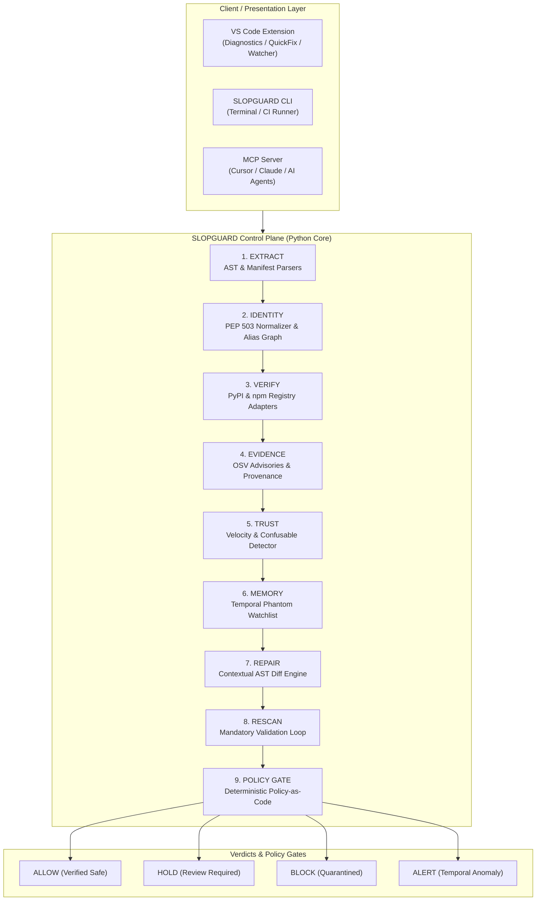

---

## 6. The Nine-Stage Pipeline

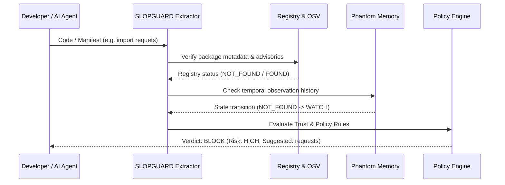

1. **EXTRACT**: AST-first parser for Python, JS/TS, and manifests (`requirements.txt`, `pyproject.toml`, `package.json`).
2. **IDENTITY**: Canonical mapping (e.g., `import cv2` -> `opencv-python`, `yaml` -> `PyYAML`).
3. **VERIFY**: Failure-isolated registry adapters ensuring HTTP 429/timeout never becomes a false `NOT_FOUND`.
4. **EVIDENCE**: Live Open Source Vulnerability (OSV) query, repository links, cryptographic provenance.
5. **TRUST**: Release velocity, account age, Damerau-Levenshtein typosquat distance, and homoglyph skeletons.
6. **MEMORY**: Temporal tracking of unresolvable packages (`NOT_FOUND` -> `WATCH` -> `APPEARED`).
7. **REPAIR**: Contextual AST patch synthesis with candidate confidence scoring.
8. **RESCAN**: Mandatory verification loop: generated patches must be rescanned before approval.
9. **POLICY GATE**: Configurable profiles (`DEVELOPMENT`, `STRICT_CI`, `ENTERPRISE`) enforcing deterministic verdicts.

---

## 7. Identity Graph

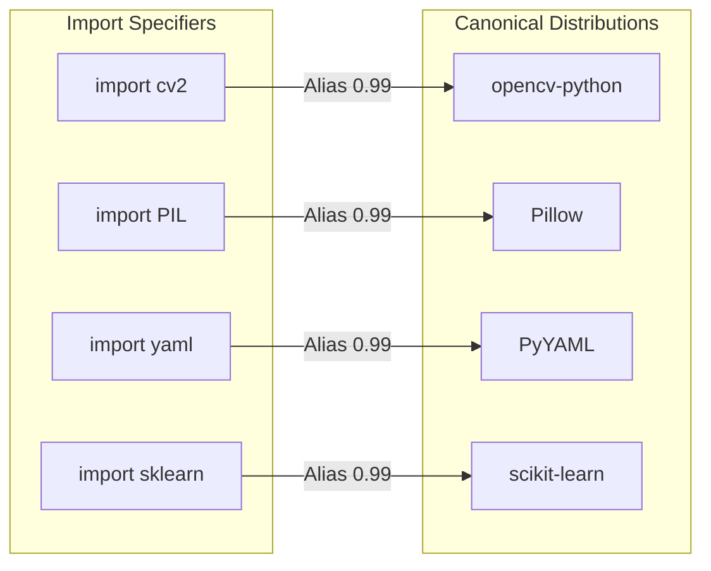

---

## 8. Evidence Graph

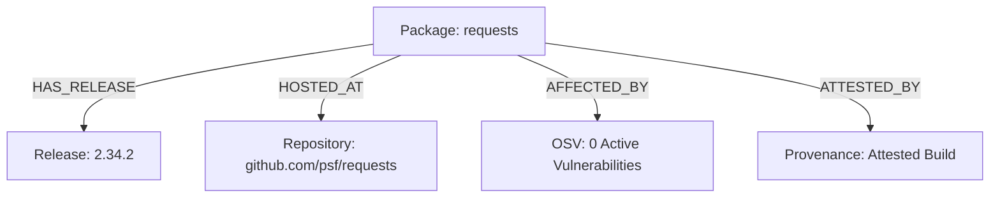

---

## 9. Trust Engine

The trust engine evaluates five independent dimensions:
1. **Identity Trust**: Canonical resolution score and alias confidence.
2. **Registry Trust**: Total release count ($\ge 3$), latest version age, and active registry status.
3. **Vulnerability Trust**: CVSS severity score from Google OSV (Critical/High triggers `BLOCK`).
4. **Adversarial Trust**: Typosquat distance to top-10,000 packages and Unicode homoglyphs.
5. **Provenance Trust**: Verified source repository linkage and build attestations.

---

## 10. Temporal Phantom Memory

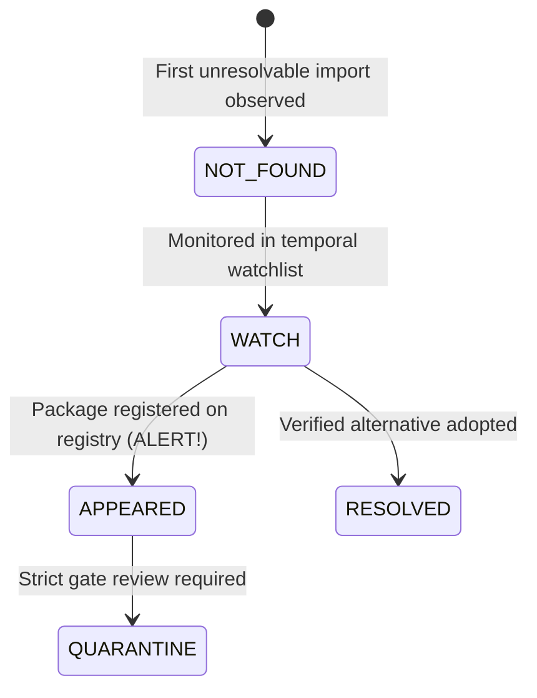

---

## 11. Contextual Repair Loop

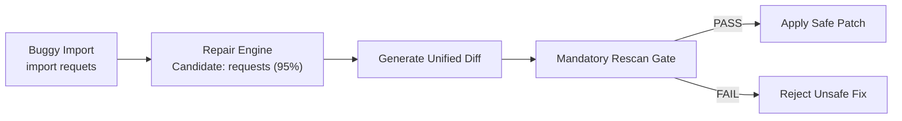

---

## 12. Policy-as-Code & Profiles

| Rule Condition | DEVELOPMENT | STRICT_CI (Default) | ENTERPRISE |
| :--- | :---: | :---: | :---: |
| Package not found (HTTP 404) | `BLOCK` | `BLOCK` | `BLOCK` |
| Typosquatting detected | `BLOCK` | `BLOCK` | `BLOCK` |
| Critical OSV advisory ($\text{CVSS} \ge 9.0$) | `BLOCK` | `BLOCK` | `BLOCK` |
| High OSV advisory ($\text{CVSS} \ge 7.0$) | `HOLD` | `BLOCK` | `BLOCK` |
| Registry failure (timeout / 429) | `HOLD` | `HOLD` | `BLOCK` |
| Package age < 30 days | `ALLOW` | `HOLD` | `BLOCK` |
| Phantom state `APPEARED` | `ALERT` | `ALERT` | `BLOCK` |

---

## 13. Multi-Interface Architecture & Working Flows

SLOPGUARD provides a unified, zero-compromise security control plane accessible through **4 synchronized interfaces**:
1. **🖥️ Web Dashboard (Interactive GUI)** — Visual command center with interactive SVG evidence graphs, phantom watchlists, and policy simulations.
2. **🤖 Model Context Protocol (MCP) Server** — Native AI tool interface for Claude Desktop, Cursor, Antigravity, and autonomous agents.
3. **⚡ VS Code Extension** — Zero-latency in-editor dependency firewall with non-blocking scans and 1-click QuickFixes.
4. **⌨️ CLI & CI/CD Engine** — High-throughput command-line runner for developer terminals, pre-commit hooks, and CI build gates.

### Unified Multi-Interface Operational Map

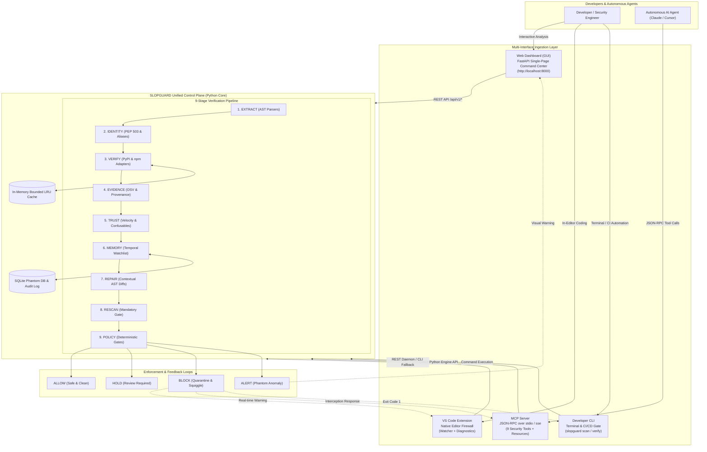

---

### 13.1 Web Dashboard (GUI)

The Web Dashboard is an interactive command center built into SLOPGUARD (`slopguard serve --port 8000`). It provides security teams, developers, and auditors with complete visual control over their supply chain.

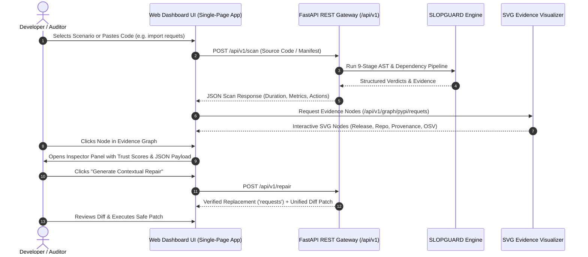

#### Core Dashboard Capabilities:
1. **Live Code Scanner**: Paste arbitrary Python/JS/TS code or manifest contents to inspect real-time AST extractions and gate decisions with timing metrics.
2. **Interactive SVG Evidence Graph**: Explores package relationships across Package, Releases, GitHub Repository, Provenance Attestations, and OSV Security Advisories with interactive color-coded status badges (`FOUND`, `LINKED`, `VERIFIED`, `ALERT`).
3. **Temporal Phantom Watchlist**: Displays real-time database records of unverified dependencies transitioning through states: `T0: NOT_FOUND` -> `T1: WATCH` -> `T2: APPEARED`.
4. **Contextual Repair Center**: Demonstrates one-click unified diff patches computed through Levenshtein distance and known package alias dictionaries.
5. **AI Agent Firewall Simulator**: Simulates agent-intercepted package installation commands (`pip install -r requirements.txt`) against Policy-as-Code rules.
6. **Policy-as-Code Studio**: Toggle live enforcement profiles (`DEVELOPMENT`, `STRICT_CI`, `ENTERPRISE`) and preview verdict impacts.
7. **Forensic Decision Reconstruction**: Detailed audit trail explaining exact rule triggers, timestamps, and confidence scores for every past gate decision.

---

### 13.2 Model Context Protocol (MCP) Server

SLOPGUARD operates as an official **Model Context Protocol (MCP)** server (`mcp>=2.0.0`), allowing LLMs and coding agents (Claude Desktop, Cursor, Antigravity, VS Code, Windsurf, Zed) to autonomously verify packages before hallucinated dependencies can ever be executed or committed.

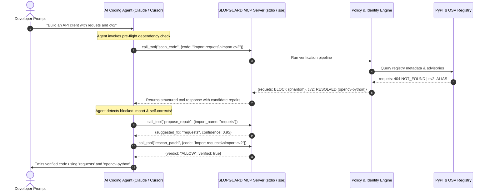

#### MCP Integration Reference:
- **Transport Modes**: `stdio` (local subprocess for Cursor/Claude Desktop) and `sse` (remote HTTP streaming).
- **Configuration (`.cursor/mcp.json` or `claude_desktop_config.json`)**:
  ```json
  {
    "mcpServers": {
      "slopguard": {
        "command": "slopguard",
        "args": ["mcp", "run", "--transport", "stdio"]
      }
    }
  }
  ```
- **CLI Commands**:
  - `slopguard mcp run [--transport stdio|sse] [--port 8001]`: Launch the MCP gateway.
  - `slopguard mcp config [--client cursor|claude|all]`: Export plug-and-play JSON configs.
  - `slopguard mcp tools`: View terminal documentation for all 9 registered MCP tools.

---

### 13.3 VS Code Extension

The VS Code extension (**[`vishaldubey2210.slopguard`](https://marketplace.visualstudio.com/items?itemName=vishaldubey2210.slopguard)**) delivers a zero-friction, native editor experience. It guarantees that the developer or AI pair-programmer is alerted in real time with high-visibility diagnostics before running code.

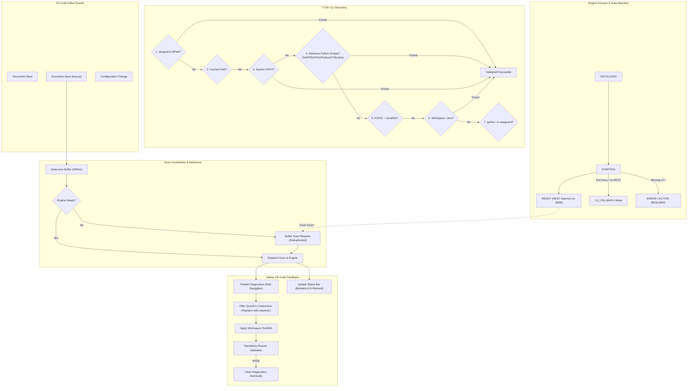

#### Architectural Highlights:
- **Zero-Config Discovery**: Probes Windows `%APPDATA%\Python\*\Scripts\slopguard.exe`, virtual environments, and system paths, injecting augmented environment variables into child processes to eliminate `ENOENT` spawn failures.
- **Startup Race-Condition Protection**: Scan requests issued during extension activation are queued and deduplicated by URI and version, executing immediately once the backend reports readiness.
- **Diagnostic Hygiene**: Atomic updates prevent diagnostic flickering, and closed documents are cleaned deterministically.
- **Rescan Enforcement**: Quick Fixes are never accepted without automated rescan verification.

---

### 13.4 CLI & CI/CD Pipeline

The SLOPGUARD CLI is built for rapid developer interaction and automated supply-chain enforcement in CI/CD pipelines (GitHub Actions, GitLab CI, Jenkins).

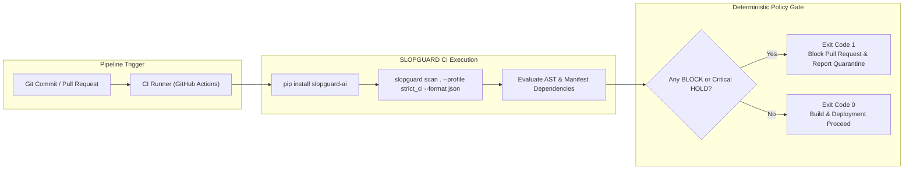

#### Core CLI Commands:
```bash
# Verify a single package identity, release history, and trust
slopguard verify requests

# Scan source code or manifests with strict policy enforcement
slopguard scan src/ --profile strict_ci

# Contextual AST repair with unified diff output
slopguard repair requets --file src/app.py

# Rescan a patched file through the mandatory validation gate
slopguard rescan src/app.py

# Run Model Context Protocol server for AI agent co-pilots
slopguard mcp run --transport stdio

# Export copy-pasteable MCP client configurations
slopguard mcp config --client all

# Launch the FastAPI REST daemon and Web Dashboard
slopguard serve --host 127.0.0.1 --port 8000
```

---

## 14. Failure-Safe Design

> **Crucial Guarantee**: Registry downtime, network timeouts, DNS failures, or HTTP 429 rate limits are **NEVER** classified as `NOT_FOUND`.

If a registry fails to respond:
1. The adapter flags the status as `TIMEOUT`, `RATE_LIMITED`, or `SERVER_ERROR`.
2. The policy engine triggers `HOLD / REVIEW`.
3. The cache prevents caching transient network failures as negative hits.

---

## 15. Benchmark & Evaluation

Evaluated on the frozen benchmark corpus across 4 standardized categories:

| Category | Samples | Status | Primary Enforcement |
| :--- | :---: | :---: | :--- |
| **REAL** (requests, fastapi, pydantic) | 4 | **PASS** | Validated multi-release histories |
| **PHANTOM** (langchain-hyper-fast-auth) | 3 | **PASS** | Blocked 404 + Temporal tracking |
| **TRICKY** (cv2, PIL, yaml, sklearn) | 4 | **PASS** | Canonical identity mapping |
| **ADVERSARIAL** (requets, homoglyphs) | 2 | **PASS** | Typosquat distance & confusable skeleton |

---

## 16. Security Model & Limitations

- **Source of Truth**: The Python core (`slopguard-ai`) is the sole authority for security decisions; the VS Code extension acts purely as a client.
- **Limitations**:
  - SLOPGUARD cannot guarantee future security of legitimately published packages that suffer post-install account takeovers.
  - Provable protection requires enforcing the `RESCAN` gate on all code patches.
  - Pre-install scanning requires AST-parseable imports or manifest files.

---

## 17. Repository Structure

```
win_if_you_can/
├── slopguard/               # Python Core Engine (Source of Truth)
│   ├── api/                 # FastAPI REST Engine & Static Web Dashboard
│   ├── audit/               # Forensic Audit Trail & Decision Reconstruction
│   ├── cli/                 # Click-based CLI Commands & Rich Terminal Output
│   ├── core/                # ScannerService & Pydantic Domain Models
│   ├── evidence/            # Evidence Graph & Provenance Extractors
│   ├── extraction/          # AST Extractors (Python, JS/TS, Manifests)
│   ├── identity/            # PEP 503 Normalizer & Alias Graph
│   ├── mcp/                 # Model Context Protocol (MCP) Server & Gateway
│   ├── memory/              # Temporal Phantom Watchlist & Transitions
│   ├── policy/              # Deterministic Policy-as-Code Engine
│   ├── registry/            # PyPI, npm, and OSV Registry Adapters
│   ├── repair/              # Contextual Candidate Generator & AST Patcher
│   └── trust/               # Multi-Dimensional Trust & Typosquat Evaluator
├── vscode-extension/        # VS Code Marketplace Extension
│   ├── src/                 # TypeScript Services, Providers, and Commands
│   ├── media/               # Icons and UI Assets
│   └── package.json         # Extension Manifest
├── tests/                   # Complete Unit, Security, & Integration Test Suite
├── docs/                    # Architecture Specifications & Audit Reports
└── pyproject.toml           # Python Package Build Configuration
```

---

## 18. Testing & Verification

Run the test suite across components:

```bash
# 1. Run Python Core Unit Tests (58 tests)
pytest tests/unit/ -v

# 2. Run VS Code Extension Automated Tests (30 tests)
cd vscode-extension
npm test

# 3. Run Real-World Acceptance Pipeline
node scripts/acceptance_test.js
```

---

## 19. Installation & Quickstart

```bash
# 1. Install from PyPI
pip install slopguard-ai

# 2. Verify installation
slopguard --version

# 3. Scan a file
slopguard scan test.py
```

---

## 20. License

SLOPGUARD is licensed under the [Apache License, Version 2.0](LICENSE).
