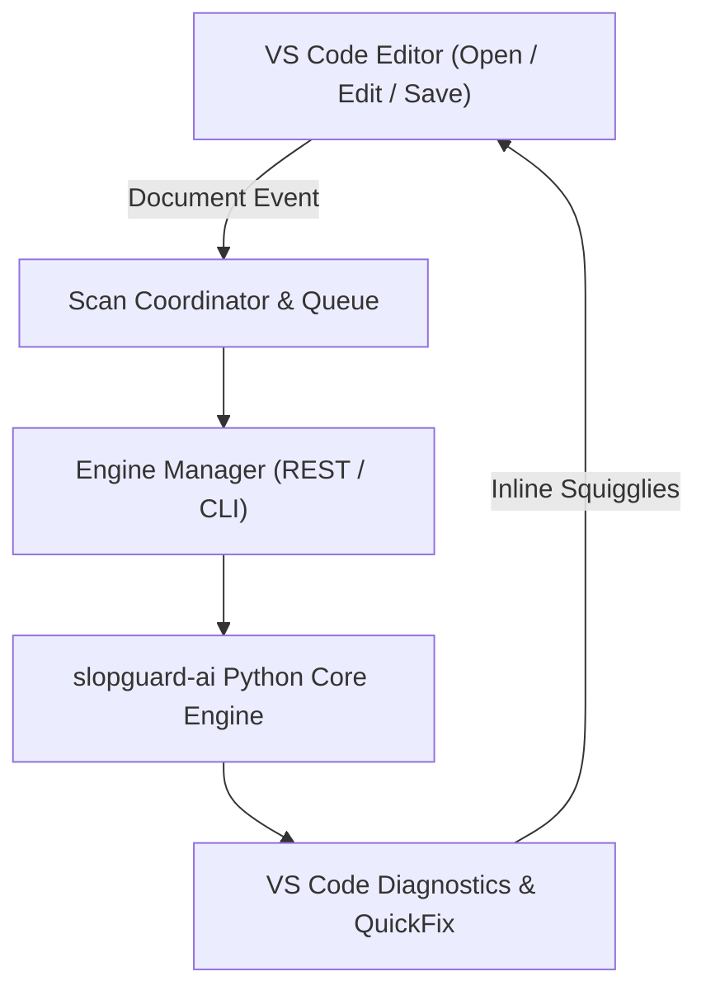

# SLOPGUARD — AI Dependency Firewall for VS Code

[](https://marketplace.visualstudio.com/items?itemName=vishaldubey2210.slopguard)
[](https://opensource.org/licenses/Apache-2.0)
[](https://pypi.org/project/slopguard-ai/)

> **Pre-install AI Dependency Control Plane & Supply-Chain Firewall for VS Code.**
> Sits directly between AI coding assistants (GitHub Copilot, Cursor, Claude Code, Gemini Code Assist, Windsurf) and external package registries to detect and prevent package hallucinations, typosquatting attacks, and malicious dependencies before installation or execution.

---

## 1. Overview
The SLOPGUARD VS Code extension (`vishaldubey2210.slopguard`) provides an always-on, pre-install defense layer inside the editor. It evaluates imports and manifests in real time, publishes high-visibility inline diagnostics, and provides 1-click Quick Fix code actions to replace hallucinated dependencies with verified packages.

---

## 2. The Problem
Autonomous AI agents and LLM code completion frequently generate hallucinated package names or make typosquatting errors. Attackers exploit this via **slopsquatting / pre-registration attacks**, registering hallucinated names on PyPI/npm with malicious pre-install hooks. Running `pip install` on an unverified dependency immediately executes attacker code on the developer machine.

---

## 3. Slopsquatting & Phantom Dependencies
- **Hallucinated Package**: The AI generates `import langchain_hyper_fast_auth`, which does not exist.
- **Pre-Registration**: An attacker claims the name on PyPI.
- **Phantom Attack**: When a developer installs the package, the attacker's `setup.py` runs with arbitrary code execution.
- **SLOPGUARD Defense**: Flags non-existent packages immediately as `BLOCK` (HTTP 404), records them in temporal memory, and halts installation attempts.

---

## 4. Architecture



---

## 5. How the Extension Works
1. **Always-On Watching**: Listens to file saves and new file creations across Python, JavaScript, TypeScript, and manifests (`requirements.txt`, `pyproject.toml`, `package.json`).
2. **Scan Coordinator**: Buffers scan requests during startup so no scans are dropped. Deduplicates requests per document.
3. **Dual Execution Engine**: Connects to the high-speed local REST API (`http://127.0.0.1:8000`) if running; automatically falls back to the local `slopguard` CLI if the daemon is stopped.
4. **Native Diagnostics**: Generates precise diagnostic squigglies mapped directly to import statement ranges.
5. **Interactive Quick Fixes**: Replaces flagged packages with verified alternatives and triggers an immediate rescan.

---

## 6. Installation from Marketplace
Install directly from the VS Code Extensions panel:
1. Open VS Code (`Ctrl+Shift+X` or `Cmd+Shift+X`).
2. Search for `SLOPGUARD`.
3. Click **Install** on `SLOPGUARD — AI Dependency Firewall` by `vishaldubey2210`.

---

## 7. Python Core Installation
SLOPGUARD requires the official `slopguard-ai` engine:
```bash
pip install slopguard-ai
```
*(Virtual environments in `.venv` or `venv` within open workspace folders are detected automatically).*

---

## 8. Automatic Scanning
Scanning occurs automatically:
- When a supported file is opened or saved.
- When manifests (`requirements.txt`, `pyproject.toml`, `package.json`) are modified.
- Across workspace files on extension startup (configurable).
- Debounced and cached in memory to prevent registry flooding.

---

## 9. Robust CLI Discovery
The extension resolves the `slopguard` binary using a 7-tier priority search:
1. User-configured path (`slopguard.cliPath`)
2. Cached verified path
3. `slopguard` on system `PATH`
4. Windows Python user Scripts (`%APPDATA%\Python\Python*\Scripts\slopguard.exe`, `%LOCALAPPDATA%\Programs\Python`)
5. macOS/Linux user bin (`~/.local/bin/slopguard`, `/opt/homebrew/bin`)
6. Workspace virtual environments (`.venv/Scripts`, `venv/bin`)
7. Python interpreter fallback (`python -m slopguard.cli.main`)

Discovered executables are validated with `slopguard --version` and logged to the `SLOPGUARD` Output channel.

---

## 10. Configuration Settings

| Setting | Type | Default | Description |
| :--- | :---: | :---: | :--- |
| `slopguard.enabled` | `boolean` | `true` | Master toggle for dependency protection. |
| `slopguard.cliPath` | `string` | `"slopguard"` | Explicit path to the `slopguard` executable. |
| `slopguard.serverUrl` | `string` | `"http://localhost:8000"` | Base URL for the SLOPGUARD REST API. |
| `slopguard.profile` | `string` | `"STRICT_CI"` | Security policy profile (`DEVELOPMENT`, `STRICT_CI`, `ENTERPRISE`). |
| `slopguard.autoScan.onSave` | `boolean` | `true` | Automatically scan supported files when saved. |
| `slopguard.scanWorkspace` | `boolean` | `true` | Automatically scan workspace dependencies on startup. |

---

## 11. Example: `import requets`
When source code contains a typo such as:
```python
import requets
```

---

## 12. Expected BLOCK Result
SLOPGUARD highlights `requets` with an error diagnostic:
```text
SLOPGUARD:
Dependency "requets" could not be verified.
Registry: NOT_FOUND
Risk: HIGH
Policy: BLOCK
Suggested fix: requests
Reasons: Package 'requets' not found on official registry (HTTP 404). Installation blocked to prevent dependency confusion and phantom hallucination attacks.
```

---

## 13. `cv2` Identity Resolution
When source code contains:
```python
import cv2
```
SLOPGUARD recognizes that `cv2` is an import alias for the canonical PyPI distribution `opencv-python`, verifies `opencv-python` release history on PyPI, and marks the import as verified (`ALLOW`).

---

## 14. Quick Fix
1. Press `Ctrl+.` (`Cmd+.` on macOS) over the flagged import.
2. Select **`SLOPGUARD: Replace 'requets' with verified 'requests'`**.
3. The editor automatically applies the replacement and triggers a mandatory rescan.
4. Upon passing policy verification, the diagnostic is removed.

---

## 15. REST + CLI Fallback
- **REST Preferred**: Fast in-memory caching and sub-10ms response times.
- **CLI Fallback**: If the REST server is unavailable, the extension automatically routes requests through the local `slopguard` binary.

---

## 16. Troubleshooting
- **CLI Not Found**: Ensure `slopguard-ai` is installed (`pip install slopguard-ai`). If in a custom environment, set `slopguard.cliPath` to the absolute binary path.
- **Inspection Logs**: Check **View > Output > SLOPGUARD** for live execution telemetry.

---

## 17. Supported Platforms
- Windows (x64, ARM64)
- macOS (Apple Silicon, Intel)
- Linux (x64, ARM64)

---

## 18. Security Limitations
- SLOPGUARD analyzes import declarations and manifest files; runtime dynamic `__import__()` with encrypted strings cannot be statically extracted.
- Safety guarantees require running the mandatory rescan validation on code changes.

---

## 19. Development Setup
```bash
git clone https://github.com/Vishaldubey2210/win_if_you_can.git
cd win_if_you_can/vscode-extension
npm install
```

---

## 20. Build Instructions
```bash
npm run compile
```

---

## 21. Testing Instructions
```bash
npm test
```
Executes the comprehensive 30-point test suite validating discovery, queueing, diagnostics, and error handling.

---

## 22. VSIX Packaging
```bash
npx @vscode/vsce package --no-git-tag-version
```

---

## 23. GitHub Repository
Source code and issues: [https://github.com/Vishaldubey2210/win_if_you_can](https://github.com/Vishaldubey2210/win_if_you_can)

---

## 24. License
Licensed under the [Apache License, Version 2.0](LICENSE).
